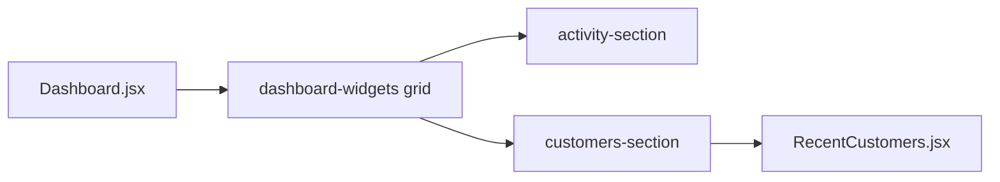

# TS-02 Final Review Summary

## Scope Reviewed

| Area | Files |
|------|--------|
| Feature | [`src/components/RecentCustomers.jsx`](src/components/RecentCustomers.jsx) (new), [`src/pages/Dashboard.jsx`](src/pages/Dashboard.jsx) |
| Tests | [`tests/Dashboard.spec.ts`](tests/Dashboard.spec.ts) |
| Requirements | [`docs/ai/stories/TS-02/spec.md`](docs/ai/stories/TS-02/spec.md), [`docs/ai/stories/TS-02/implementation-plan.md`](docs/ai/stories/TS-02/implementation-plan.md) |
| Reference | [`src/components/RecentActivity.jsx`](src/components/RecentActivity.jsx) (style parity) |

Pipeline artifacts under [`.opencode/executions/exec-78dad94f-416c-4df5-8a2c-77fbf2b5b888/`](.opencode/executions/exec-78dad94f-416c-4df5-8a2c-77fbf2b5b888/) were reviewed for scope creep only (not application logic).

## Verdict

**Approve** — implementation is complete and aligned with TS-02 spec and the implementation plan. No blocking code issues.

## Acceptance Criteria

| Criterion | Status | Evidence |
|-----------|--------|----------|
| UI alignment with Recent Activity | Met | Row cards match activity list: white card, `#f1f3f9` border, shadow, 40px avatar `#4f46e5`, typography |
| 3 mock records | Met | `customers` const in Dashboard; `customer-item-1..3` testids |
| Status badges (Active green, Pending yellow/orange) | Met | `statusStyles()` + Playwright CSS assertions on rows 1 and 3 |
| Responsiveness | Met (code) | `repeat(auto-fit, minmax(320px, 1fr))`, `minWidth: 0` on sections; not Playwright-automated |
| No backend dependency | Met | Static `customers` array; no `fetch`/`axios`/`useEffect` in new/edited source |

## Implementation vs Plan

- **Placement**: Two-column widget row via `data-testid="dashboard-widgets"` with activity left, customers right — matches plan.
- **Component**: Prop-driven `RecentCustomers({ customers })` with required `data-testid`s including `recent-customers-widget`, `customer-list`, per-row ids — matches plan.
- **Mock data**: David Jones, Emma Watson, Frank Miller with correct emails and statuses — matches spec table.
- **Out of scope respected**: No search filter on customers; no edits to `Sidebar`, `StateCard`, or dead `dashboard.jsx`.
- **Minor drift (non-blocking)**: Mock field uses `avatar` instead of spec JSON key `initials`; functionally equivalent.

## Tests

New describe block **Dashboard - Recent Customers** covers:

- Section title and `customers-section` visibility
- Exactly 3 `customer-item-*` rows
- Row 1 and 3 name/email/avatar/status text
- Active vs Pending badge computed colors

**Gap (informational, not blocking):** Row 2 (Emma Watson) field values are not asserted individually; row count and row 1/3 assertions still validate rendering.

## Validation Run (this review)

| Command | Result |
|---------|--------|
| `npm run lint` | Pass (no errors) |
| `npm run build` | Pass (Vite Node 20.18 vs 20.19+ warning is pre-existing) |
| `npx playwright test tests/Dashboard.spec.ts --grep "Recent Customers"` | **Not verified** — all 12 runs failed: Playwright browser binaries missing (`npx playwright install` required). Failure is environment, not test logic. |

**Pre-merge recommendation:** Run full `npx playwright test tests/Dashboard.spec.ts` after `npx playwright install` to confirm no regressions in existing activity tests after the layout grid change.

## Findings

**R1 (Low — commit scope):** Working tree includes untracked pipeline outputs under `.opencode/executions/exec-78dad94f-416c-4df5-8a2c-77fbf2b5b888/` (context packs, handoffs, cursor streams). The implementation plan explicitly excludes these from feature edits. **Do not stage/commit** execution artifacts with TS-02; commit only `src/components/RecentCustomers.jsx`, `src/pages/Dashboard.jsx`, `tests/Dashboard.spec.ts`, and optionally `docs/ai/stories/TS-02/*`.

## Handoff for Downstream

- **auto_fixer**: Not required for code defects.
- **Governance / merge**: Run Playwright after browser install; keep commit scope to application files per R1.

## Output Artifact

When approved, write this summary to:

[`.opencode/executions/exec-78dad94f-416c-4df5-8a2c-77fbf2b5b888/final-summary.md`](.opencode/executions/exec-78dad94f-416c-4df5-8a2c-77fbf2b5b888/final-summary.md)
